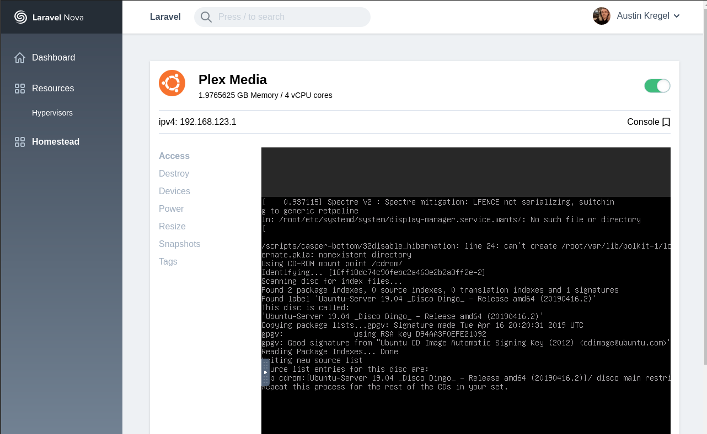

# A Nova tool to help manage your virtual machine hypervisors.

[](https://packagist.org/packages/kregel/homestead)
[](https://packagist.org/packages/kregel/homestead)

Have you ever just wanted an interface for managing your virtual machines, and not have it look like it came out of the early 2000s? Look no further. This package aims to satisfy a very very very very small niche portion of hobbyists who both have a Laravel Nova download available, and need to manage virtual machines.

This package does currently support remote management, so assuming you have all the ports open to the server this app is hosted from, and the user you're connecting as has permissions to access all the files, you could host this app on a DigitalOcean server and manage a VM server in your house. :wink:

### Quick Nav
  - [What's the alternative](#whats-the-alternative)
  - [Project goal](#goal)
  - [Before we begin](#before-we-begin)
  - [Installing libvirt-php from this package](#installing-libvirt-php-from-this-package)
  - [Installing a VNC Client](#installing-a-vnc-client)
  - [Managing VNC](#managing-vnc)
  - [Permissions](#permissions)
  - [Developing/contributing to this project](#developingcontributing-to-this-project)
  - [Libvirt-php auto complete](#libvirt-php-auto-complete)
  - [Using the LibvirtService class outside nova](#abstraction)
  - [Security](#security)
  - [License](#license)
  - [Support me or this package](#support)

### What's the alternative?  
Well, for this specific piece of software, I'm not aware of many alternatives... (They probably exist...)



[See other screenshots](SCREENSHOTS.md) 
# Goal
Get very basic create/read/update/delete functionality for just creating new VMs on a host.
    
 - [x] Create (#1)
 - [x] Read
 - [ ] Update
 - [x] Delete
 - [x] Start VMs
 - [x] Stop VMs
 - [x] Force stop VMs
 - [x] Access Via VNC
 - [x] Restart VM
 - [x] SSH remote management 
 - [x] SSH private key authentication
 - [x] Password Authentication
 - [x] Multiple hypervisors
 - [ ] Custom networking
 - [ ] Edit disks of the VM (increase size, change format?)
 
Bonus:
 - [ ] Add pass through devices?
 - [ ] Add snapshots? (Looks like it could be possible through libvirt)
 - [ ] Tag the VMs with things, and the be able to manage the tags in the UI.
 - [ ] Add a way to let the VMs download isos from a remote source.
 - [ ] Add a way to manage ISOs so your VMs don't have to reach out to an external server for downloading the ISOs
 - [ ] View Guest CPU stats and display those in graphs on the VM's Show page.
 - [ ] Test driver LXC - Linux Containers
 - [ ] Test driver OpenVZ
 - [x] Test driver QEMU
 - [ ] Test driver VirtualBox
 - [ ] Test driver VMware ESX
 - [ ] Test driver VMware Workstation/Player
 - [ ] Test driver Xen
 - [ ] Test driver Microsoft Hyper-V
 - [ ] Test driver Virtuozzo
 - [ ] Test driver Bhyve - The BSD Hypervisor
 - [ ] [Qcow2 disk encryption for QEMU](https://www.berrange.com/posts/2009/12/02/using-qcow2-disk-encryption-with-libvirt-in-fedora-12/) 
 
# Before we begin.
This is just an admin dashboard for hypervisors. A hypervisor control panel if you will. You do not need qemu, or virt-manager on the webserver you serve this from. However, you do need to use the libvirt library that comes with this package. The library built into this package has been patched, and updated to have fewer hidden error messages and  fix some bugs.

## Installing this package
```bash
composer require kregel/nova-homestead
```
Letting Nova know about it's existence.

```php
// In your app/Providers/NovaServiceProvider.php

public function tools()
{
    return [
        // ...
        new \Kregel\Homstead\Homestead(),
    ];
}
```
## Installing libvirt-php from this package.
```
cd vendor/kregel/homestead/docker/php/libvirt-php
./autogen.sh
make
sudo make install
```
If installation fails, it's usually due to a missing package. Googling around for the missing package will be your best option. 
 
## Installing a VNC Client
In order to view the output of your VM directly, you'll want to use this VNC client. I have only personally tested this out with `novnc` on Ubuntu 19.04 for QEMU.
```bash
sudo apt update
sudo apt install snapd
sudo snap install novnc
```

## Managing VNC
At the moment, my understanding is that to view a VM's tty session we have to spin up a new instance of novnc to proxy that VM's output to your broswer. At the moment, I'm not sure how to support that. If you know how to manage this, please make an issue or a PR!.

So for the moment, I just test with 1 VM and I have 1 instance of novnc running that I start manually. It's kind of a pain I know, but it works for now.

## Permissions 
Ensure that the user has access to the group `libvirt-qemu`. Usually this mean run the program as root, but if you know another way, give that a shot.

# Developing/Contributing to this project
Please see [CONTRIBUTING](CONTRIBUTING.md) for details.

## Release notes
As this projects gets built out further and further, you can keep track of the releases on [Changelager](https://nova-homestead.changed.to/1274).

## libvirt-php auto complete
At the moment there's a script called `build-doc.php` which will extract all methods from the libvirt library and put it into the `.phpstorm.meta.php` file. The logic of what happens within those methods can only be find in the `./docker/php/libvirt-php/src` directory in the original C/C++ code.

## Abstraction
The underlying APIs of this package don't require [Laravel Nova](https://nova.laravel.com) and can be used outside of it. You'll just need to ensure `illuminate/support` at any version >5.0.

## Security
If you discover any security related issues, please email [security@metabit.services](mailto:security@metabit.services?subject=Potential+security+issue+with+nova+homestead) instead of using the issue tracker.

## License
The MIT License (MIT). Please see [License File](LICENSE.md) for more information.

## Support
If you enjoy my content, please consider supporting me on [Kofi](https://ko-fi.com/Z8Z2W2FZ).
